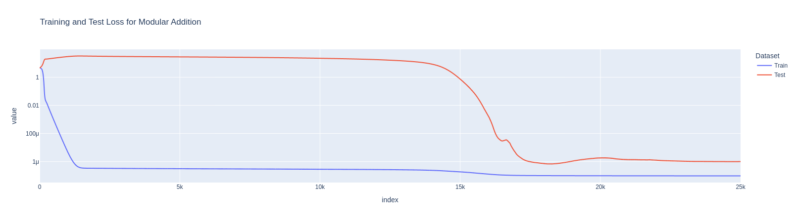

# 🧠 Grokking Lab: Modular Addition in Small Models

This repo is a clean, extensible PyTorch **mini-lab** for studying **grokking** — the surprising phenomenon where small models suddenly transition from **memorization** to **generalization** after very long training.

It reproduces grokking on **modular addition** with tiny MLPs, and provides a base to explore further with transformers, data sweeps, and optimizer ablations.

## 🌟 What is Grokking?

- **Phenomenon:** A model quickly learns to memorize the training set (100% train accuracy) but fails to generalize (test accuracy near random).  
- **Surprise:** After much longer training, and with weight decay, the model suddenly **snaps into generalization**, with test accuracy jumping near 100%.  
- **Why it matters:** Grokking highlights the tension between memorization and algorithmic generalization, and is a fertile ground for research into optimization dynamics, implicit bias, and representation learning.



## 🚀 Quickstart

### 1. Setup

```bash
git clone https://github.com/qalmaqihir/grokking-lab.git
cd grokking-lab
python3 -m venv .venv
source .venv/bin/activate
pip install torch matplotlib
````

### 2. Run your first grokking experiment

```bash
python grokking_lab.py --device cuda --steps 150000 --weight_decay 1e-3 --train_fraction 0.5
```

* `--device cuda` → runs on your GPU (e.g., RTX 4090 - In my Case).
* `--steps` → training steps (50k–200k needed for a clear grok).
* `--weight_decay` → essential for grokking (try 0 vs 1e-3).
* `--train_fraction` → fraction of (a,b) pairs used for training; rest is test.

Results (logs + plots) are saved in `runs/grokking_modadd/`.


## 📊 Outputs

The script logs and plots:

* **Train/Test Accuracy**
* **Train/Test Loss**
* **Parameter L2 Norms** (||θ||₂)

Look for:

* Train accuracy → \~1.0 early
* Test accuracy → flat (near random), then **sharp rise**
* Parameter norms → drift then stabilize around the grok


## 🔬 Suggested Experiments

Try these to explore the grokking landscape:

1. **Weight Decay Sweep**
   Compare `--weight_decay 0.0` vs `1e-5 ... 1e-3`.
   → Plot “time-to-grok” vs weight decay.

2. **Training Fraction Sweep**
   Change `--train_fraction 0.25 ... 0.85`.
   → Some fractions grok, others don’t.

3. **Task Variants**
   Replace addition with multiplication `(a*b) mod P`.
   → Harder, often groks later.

4. **Learning Rate & Schedules**
   Test `--lr 5e-4` vs `1e-3`. Try cosine decay.
   → Observe sensitivity of grok timing.

5. **Control: Random Labels**
   Shuffle labels; grokking should disappear.
   → Sanity check.

## 📚 Background Reading

* [*Grokking: Generalization Beyond Overfitting on Small Algorithmic Datasets*](https://arxiv.org/abs/2201.02177)
* [A Mechanistic Interpretability Analysis of Grokk](https://www.alignmentforum.org/posts/N6WM6hs7RQMKDhYjB/a-mechanistic-interpretability-analysis-of-grokking)  
* [Interlude: A Mechanistic Interpretability Analysis of Grokking](https://www.neelnanda.io/blog/interlude-a-mechanistic-interpretability-analysis-of-grokking)  


## 📝 Research Directions

This repo is designed to be extended into a research project. Some ideas:

* Map out a **phase diagram of grokking** (data fraction × weight decay × learning rate).
* Compare **MLP vs tiny transformer** architectures.
* Study **parameter norm dynamics per layer** before/after grokking.
* Explore **optimizer effects** (Adam vs SGD).

If you use this repo in your own research, feel free to cite or link back. Contributions welcome!


## ⚙️ Example Command Cheatsheet

```bash
# Baseline grokking run
python grokking_lab.py --device cuda --steps 150000 --weight_decay 1e-3 --train_fraction 0.5

# No weight decay (should memorize only)
python grokking_lab.py --device cuda --steps 150000 --weight_decay 0.0 --train_fraction 0.5

# Less training data (often groks clearer)
python grokking_lab.py --device cuda --steps 200000 --weight_decay 1e-3 --train_fraction 0.35

# Different modulus
python grokking_lab.py --device cuda --steps 150000 --P 59 --weight_decay 1e-3
```

## 🧑‍💻 Author

Built for learning, exploration, and research inspiration.
Made with ❤️ and PyTorch.
